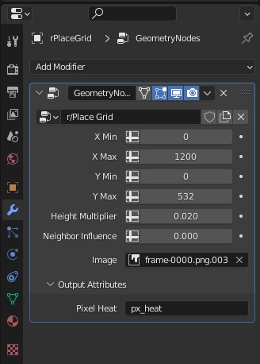

# Rendering With Blender

The final step is to load the color and age maps into Blender and render the frames we want.

There's nothing fancy about the `r-place.blend` file. It doesn't require any addons, and you don't need to run any scripts within Blender. All it has is a camera and a grid generated by geometry nodes. All we need to do is load the color and age maps into the scene.

## Loading the Color and Age Maps

If you saved your color and heat maps in `data/frames_color` and `data/frames_heat`, they should already be rendered in the scene. If not, you just need to load the image sequences in the geometry and shader nodes.

## Geometry Node Modifier Settings

The geometry nodes setup is quite simple. It creates a platform with a 2000x2000 grid on top of it. The grid is extruded according to the heat map. You should be able to adjust everything from the modifier settings. You don't have to change anything in the nodes setup.

Here's an overview of the settings:

- "X Min", "X Max", "Y Min", "Y Max": Most computers will struggle to render the full grid. For better performance, we can render only the parts of the grid that are visible in the final render. These settings let you fine-tune the rendered area. Tip: you can even animate these values as the camera moves around the scene.
- Height Multiplier: Adjust this to control the height of the pixels.
- Neighbor Influence: By controlling the [interpolation](https://docs.blender.org/manual/en/dev/modeling/geometry_nodes/texture/image.html) of the pixels, we can control the amount of influence of neighboring pixels on the grid. This lets us give more emphasis to places where several pixels are changing at the same time.
- Image: The age map image sequence.
- Pixel Heat: An output attribute that you can use in the shader nodes to get the age of the pixels.

## Conclusion

This project has inspired me to learn more about data science and data visualization. I'm really excited to see what other people can do with it. Please share your artwork with me and the whole Blender community!

If you noticed mistakes or you just want some help with this project, please create an issue here in the [GitHub repository](https://github.com/ChrisCrossCrash/r-place-blender/issues). I'll do my best to help you.

Thanks for checking out my work!
